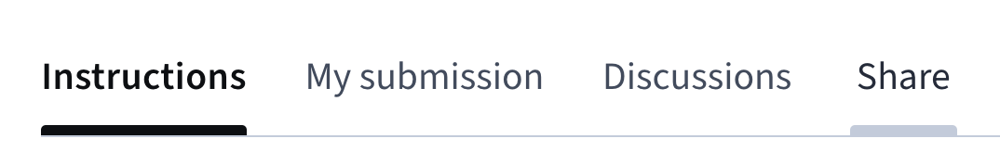

# Coursera to Link

**Note: This extension is currently for Firefox only.**

This extension adds a `Share` button to Coursera peer-graded assignment pages. Clicking the button generates a direct link to your assignment submission and copies it to your clipboard so you can share it with others for review.

## Usage

1. Open a Coursera peer-graded assignment page in Firefox.
2. Look for the new `Share` button in the tab menu.
3. Click it to automatically generate and copy your direct review link to the clipboard.

## License

This project is licensed under the [MIT License](LICENSE).
